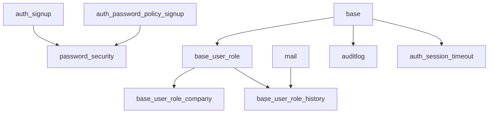

# Odoo ISO - Módulos de Seguridad y Gestión de Usuarios

[](https://www.gnu.org/licenses/agpl-3.0)
[](https://www.gnu.org/licenses/lgpl-3.0)
[](https://odoo.com/)
[](https://runboat.odoo-community.org)

Este repositorio contiene una colección de módulos de Odoo 17.0 enfocados en seguridad, auditoría y gestión avanzada de usuarios. Los módulos están basados en estándares ISO y mejores prácticas de seguridad empresarial.

## Módulos Disponibles

| Módulo | Versión | Categoría | Descripción | Estado |
|--------|---------|-----------|-------------|--------|
| [auditlog](#auditlog) | 17.0.1.0.5 | Herramientas | Registro de auditoría de operaciones de usuarios | Producción ✅ |
| [auth_session_timeout](#auth_session_timeout) | 17.0.1.0.1 | Herramientas | Timeout automático de sesiones inactivas | Estable ✅ |
| [base_user_role](#base_user_role) | 17.0.1.1.2 | Herramientas | Sistema de roles de usuario avanzado | Estable ✅ |
| [base_user_role_company](#base_user_role_company) | 17.0.1.1.1 | Herramientas | Roles de usuario por compañía | Beta ⚠️ |
| [base_user_role_history](#base_user_role_history) | 17.0.1.0.0 | Herramientas | Historial de cambios en roles de usuario | Beta ⚠️ |
| [password_security](#password_security) | 17.0.2.0.0 | Base | Políticas avanzadas de seguridad de contraseñas | Estable ✅ |

## Descripción de Módulos

### auditlog
**Registro de Auditoría**

Permite al administrador registrar todas las operaciones realizadas por los usuarios en los modelos de datos (`crear`, `leer`, `escribir`, `eliminar`). Essential para cumplimiento de normativas ISO 27001 y auditorías de seguridad.

**Características principales:**
- Registro automático de todas las operaciones CRUD
- Configuración flexible de qué modelos auditar
- Vista detallada de logs de auditoría
- Limpieza automática de logs antiguos (autovacuum)
- Soporte para múltiples compañías

**Autor:** ABF OSIELL, Odoo Community Association (OCA)
**Licencia:** AGPL-3

### auth_session_timeout
**Timeout de Sesiones Inactivas**

Desconecta automáticamente las sesiones de usuario que permanecen inactivas por un tiempo determinado, mejorando la seguridad del sistema.

**Características principales:**
- Configuración de tiempo de inactividad personalizable
- Logout automático y limpio de sesiones
- Verificación en cada request del servidor
- Parámetros configurables por empresa

**Autores:** ACSONE SA/NV, Dhinesh D, Jesse Morgan, LasLabs, Odoo Community Association (OCA)
**Licencia:** AGPL-3

### base_user_role
**Sistema de Roles de Usuario**

Extiende la funcionalidad estándar de usuarios y grupos, facilitando la creación de roles funcionales bien definidos y su asignación a usuarios.

**Características principales:**
- Definición de roles funcionales agregando grupos de bajo nivel
- Asignación múltiple de roles a usuarios (acumulativos)
- Actualización masiva de grupos para cuentas relevantes
- Control estricto: usuarios con roles no pueden modificar grupos manualmente
- Activación/desactivación temporal de roles por fechas
- Vista rápida de roles y cuentas de usuario relacionadas

**Autores:** ABF OSIELL, Odoo Community Association (OCA)
**Mantenedores:** sebalix, jcdrubay, novawish
**Licencia:** LGPL-3

### base_user_role_company
**Roles de Usuario por Compañía**

Permite habilitar roles de usuario específicos dependiendo de las compañías seleccionadas, ideal para entornos multi-compañía.

**Características principales:**
- Roles específicos por compañía
- Solo se habilita un rol si está configurado para TODAS las compañías seleccionadas
- Integración transparente con base_user_role
- Instalación automática cuando se instala base_user_role

**Autores:** Open Source Integrators, Odoo Community Association (OCA)
**Mantenedor:** dreispt
**Licencia:** AGPL-3

### base_user_role_history
**Historial de Roles de Usuario**

Proporciona un historial completo de modificaciones en los roles de usuario, registrando qué cambios se realizaron y quién los hizo.

**Características principales:**
- Historial de adición/actualización/eliminación de roles
- Registro de autor y fecha de cada cambio
- Smart button desde vista de usuario
- Trazabilidad completa de cambios en roles

**Autores:** ACSONE SA/NV, Odoo Community Association (OCA)
**Mantenedor:** ThomasBinsfeld
**Licencia:** AGPL-3

### password_security
**Seguridad de Contraseñas**

Permite al administrador establecer políticas de seguridad de contraseñas a nivel de empresa, asegurando el cumplimiento de estándares de seguridad.

**Características principales:**
- Configuración de días de expiración de contraseñas
- Longitud mínima requerida
- Número mínimo de letras minúsculas
- Número mínimo de letras mayúsculas  
- Número mínimo de dígitos
- Número mínimo de caracteres especiales
- Historial de contraseñas para evitar reutilización

**Autores:** LasLabs, Onestein, Kaushal Prajapati, Tecnativa, initOS GmbH, Omar Nasr, Odoo Community Association (OCA)
**Licencia:** LGPL-3

## Instalación

### Requisitos Previos
- Odoo 17.0
- Python 3.8+
- PostgreSQL 10+

### Instalación desde el Código Fuente

1. Clone este repositorio en el directorio de addons de Odoo:
```bash
git clone https://github.com/focuz-ai/odoo-iso.git /path/to/odoo/addons/odoo-iso
```

2. Actualice la lista de addons en Odoo:
```bash
./odoo-bin -u all -d your_database
```

3. Instale los módulos requeridos desde la interfaz de Odoo o vía línea de comandos:
```bash
./odoo-bin -d your_database -i auditlog,auth_session_timeout,base_user_role,password_security
```

### Instalación via pip (si está disponible)
```bash
pip install odoo-addon-auditlog
pip install odoo-addon-auth-session-timeout
pip install odoo-addon-base-user-role
pip install odoo-addon-password-security
```

## Configuración

### Configuración General

1. **Registro de Auditoría (auditlog):**
   - Vaya a Configuración > Técnico > Registro de Auditoría > Reglas
   - Configure qué modelos desea auditar
   - Configure la limpieza automática de logs

2. **Timeout de Sesiones (auth_session_timeout):**
   - Vaya a Configuración > Parámetros del Sistema
   - Configure `inactive_session_time_out_delay` (en segundos)

3. **Roles de Usuario (base_user_role):**
   - Vaya a Configuración > Usuarios y Compañías > Roles
   - Defina sus roles funcionales
   - Asigne roles a usuarios desde el formulario de usuario

4. **Seguridad de Contraseñas (password_security):**
   - Vaya a Configuración > Configuración General > Usuarios
   - Configure las políticas de contraseñas en la sección "Seguridad de Contraseñas"

### Configuraciones Avanzadas

Para configuraciones específicas de cada módulo, consulte la documentación en las carpetas `readme/` de cada módulo.

## Uso

### Casos de Uso Típicos

1. **Cumplimiento de Normativas ISO 27001:**
   - Use `auditlog` para rastrear todas las operaciones críticas
   - Configure `auth_session_timeout` para sesiones seguras
   - Implemente `password_security` para políticas fuertes

2. **Gestión de Usuarios Empresariales:**
   - Use `base_user_role` para definir roles departamentales
   - Use `base_user_role_company` en entornos multi-compañía
   - Use `base_user_role_history` para auditorías de cambios

3. **Seguridad Reforzada:**
   - Combine todos los módulos para máxima seguridad
   - Configure alertas automáticas en logs de auditoría
   - Establezca políticas de contraseñas estrictas

## Dependencias entre Módulos



## Mantenimiento y Soporte

### Mantenedores Actuales
- **auditlog:** ABF OSIELL, OCA
- **auth_session_timeout:** OCA
- **base_user_role:** sebalix, jcdrubay, novawish
- **base_user_role_company:** dreispt
- **base_user_role_history:** ThomasBinsfeld
- **password_security:** OCA Community

### Reporte de Bugs y Solicitudes de Funcionalidades

Por favor, reporte bugs y solicite funcionalidades a través de:
- [GitHub Issues](https://github.com/focuz-ai/odoo-iso/issues)
- [OCA Server Tools](https://github.com/OCA/server-tools/issues) (para auditlog)
- [OCA Server Auth](https://github.com/OCA/server-auth/issues) (para auth_session_timeout, password_security)
- [OCA Server Backend](https://github.com/OCA/server-backend/issues) (para módulos base_user_role)

## Contribuir

### Guías de Contribución

1. **Fork** el repositorio
2. **Clone** su fork localmente
3. **Cree** una rama para su funcionalidad: `git checkout -b feature/mi-nueva-funcionalidad`
4. **Commit** sus cambios: `git commit -am 'Agregar nueva funcionalidad'`
5. **Push** a la rama: `git push origin feature/mi-nueva-funcionalidad`
6. **Envíe** un Pull Request

### Estándares de Código

- Siga las [Directrices de Desarrollo de OCA](https://odoo-community.org/page/development-guidelines)
- Use [pylint_odoo](https://github.com/OCA/pylint-odoo) para verificar calidad del código
- Incluya tests para nuevas funcionalidades
- Mantenga la documentación actualizada

### Pre-commit Hooks

Este repositorio usa pre-commit hooks. Para instalarlos:

```bash
pip install pre-commit
pre-commit install
```

## Testing

### Ejecutar Tests

```bash
# Tests unitarios
./odoo-bin -d test_database --test-enable --stop-after-init -i module_name

# Tests específicos
./odoo-bin -d test_database --test-enable --stop-after-init --test-tags /module_name
```

### Cobertura de Tests

Los módulos incluyen tests comprensivos que cubren:
- Funcionalidad core de cada módulo
- Casos edge y manejo de errores
- Integración entre módulos relacionados
- Configuraciones multi-compañía

## Licencias

Este repositorio contiene módulos bajo diferentes licencias:

- **AGPL-3:** auditlog, auth_session_timeout, base_user_role_company, base_user_role_history
- **LGPL-3:** base_user_role, password_security

Consulte el archivo `__manifest__.py` de cada módulo para detalles específicos de licencia.

## Créditos

### Autores y Mantenedores

Este proyecto está basado en módulos desarrollados por la Odoo Community Association (OCA) y sus contribuidores:

- **ABF OSIELL** - Desarrollo inicial de auditlog y base_user_role
- **ACSONE SA/NV** - auth_session_timeout y base_user_role_history  
- **LasLabs** - password_security
- **Open Source Integrators** - base_user_role_company
- **Odoo Community Association (OCA)** - Mantenimiento y coordinación

### Adaptación y Mantenimiento

- **FOCUZ AI S.A.C.** - Adaptación para cumplimiento ISO y mercado latinoamericano

### Agradecimientos

Agradecemos a toda la comunidad OCA y sus contribuidores por hacer posibles estos módulos de alta calidad.

---

**Nota:** Este repositorio está diseñado para facilitar el cumplimiento de normativas ISO 27001, ISO 27002 y otros estándares de seguridad de la información en implementaciones de Odoo empresariales.