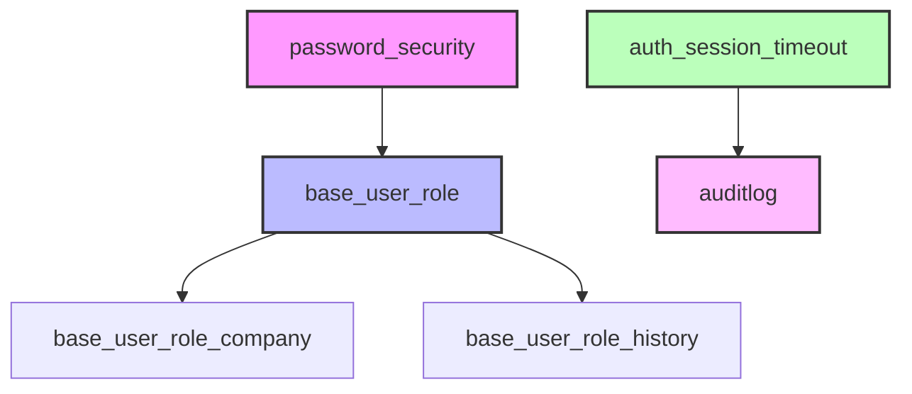

# Odoo ISO - Módulos de Seguridad y Gestión de Usuarios

[](https://github.com/focuz-ai/odoo-iso)
[](https://github.com/focuz-ai/odoo-iso)
[](https://www.odoo.com/)
[](http://www.gnu.org/licenses/agpl-3.0-standalone.html)
[](https://github.com/OCA)

## Descripción

Este repositorio contiene una colección de módulos de Odoo 17 enfocados en la **seguridad**, **gestión de usuarios** y **cumplimiento normativo ISO**. Estos módulos han sido adaptados y optimizados para cumplir con los estándares de seguridad empresarial y las mejores prácticas de la industria.

Los módulos incluidos proporcionan funcionalidades avanzadas para:
- 🔒 **Seguridad de contraseñas** con políticas empresariales
- 📝 **Auditoría completa** de operaciones del sistema
- 👥 **Gestión de roles** y permisos granulares
- ⏰ **Control de sesiones** con timeout automático
- 🏢 **Roles por compañía** para entornos multi-empresa
- 📊 **Historial de cambios** en permisos y roles

## Módulos Disponibles

| Módulo | Versión | Descripción | Estado |
|--------|---------|-------------|---------|
| [auditlog](auditlog/) | 17.0.1.0.5 | Registro de auditoría completo de operaciones CRUD | ✅ Producción |
| [auth_session_timeout](auth_session_timeout/) | 17.0.1.0.1 | Cierre automático de sesiones inactivas | ✅ Estable |
| [base_user_role](base_user_role/) | 17.0.1.1.2 | Sistema avanzado de roles de usuario | ✅ Estable |
| [base_user_role_company](base_user_role_company/) | 17.0.1.1.1 | Roles específicos por compañía | ⚠️ Beta |
| [base_user_role_history](base_user_role_history/) | 17.0.1.0.0 | Historial de cambios en roles | ⚠️ Beta |
| [password_security](password_security/) | 17.0.2.0.0 | Políticas avanzadas de seguridad de contraseñas | ✅ Estable |

## Características Principales

### 🔐 **Seguridad Empresarial**
- Políticas de contraseña configurables (longitud, complejidad, caducidad)
- Historial de contraseñas para prevenir reutilización
- Bloqueo automático después de intentos fallidos
- Verificación de contraseñas comprometidas

### 📋 **Auditoría y Cumplimiento**
- Registro detallado de todas las operaciones CRUD
- Seguimiento de cambios en campos específicos
- Logs de acceso HTTP y sesiones
- Cumplimiento con ISO 27001 y SOX

### 👤 **Gestión Avanzada de Usuarios**
- Sistema de roles con herencia
- Asignación de roles por fecha/tiempo
- Roles específicos por compañía
- Historial completo de cambios de permisos

### ⚡ **Control de Sesiones**
- Timeout configurable por inactividad
- Cierre automático de sesiones
- Parámetros diferentes para usuarios internos y portal
- Gestión de sesiones concurrentes

## Instalación

### Requisitos Previos
- Odoo 17.0 Community o Enterprise
- Python 3.8+
- PostgreSQL 12+

### Pasos de Instalación

1. **Clonar el repositorio:**
```bash
cd /path/to/odoo/addons
git clone https://github.com/focuz-ai/odoo-iso.git
```

2. **Actualizar el path de addons en odoo.conf:**
```ini
addons_path = /path/to/odoo/addons,/path/to/odoo-iso
```

3. **Reiniciar el servidor Odoo:**
```bash
sudo systemctl restart odoo
```

4. **Actualizar la lista de aplicaciones:**
   - Ir a Aplicaciones > Actualizar lista de aplicaciones
   - Buscar e instalar los módulos deseados

## Configuración

### Configuración Básica

#### Password Security
1. Ir a **Configuración > Usuarios y Compañías > Seguridad de Contraseñas**
2. Configurar:
   - Longitud mínima de contraseña
   - Requisitos de complejidad
   - Días de caducidad
   - Historial de contraseñas

#### Session Timeout
1. Ir a **Configuración > Técnico > Parámetros del Sistema**
2. Configurar los parámetros:
   - `inactive_session_time_out_delay`: Tiempo en segundos (predeterminado: 7200)
   - `inactive_session_time_out_ignored_url`: URLs ignoradas

#### Audit Log
1. Ir a **Configuración > Técnico > Reglas de Auditoría**
2. Crear reglas para los modelos a auditar
3. Configurar campos específicos a monitorear
4. Establecer período de retención de logs

### Configuración Avanzada

#### Roles de Usuario
```python
# Ejemplo de creación de rol programático
role = self.env['res.users.role'].create({
    'name': 'Supervisor de Ventas',
    'group_ids': [(6, 0, [
        self.ref('sales_team.group_sale_manager'),
        self.ref('stock.group_stock_user'),
    ])],
    'company_id': self.env.company.id,
})

# Asignar rol a usuario
user.role_line_ids = [(0, 0, {
    'role_id': role.id,
    'date_from': fields.Date.today(),
    'date_to': fields.Date.today() + timedelta(days=365),
})]
```

## Casos de Uso

### 🏢 **Empresas Multi-nacionales**
Gestión de roles diferenciados por país/compañía con auditoría completa de cambios.

### 🏥 **Sector Salud**
Cumplimiento HIPAA con auditoría detallada y políticas estrictas de contraseñas.

### 🏦 **Sector Financiero**
Cumplimiento SOX con trazabilidad completa y control de acceso granular.

### 🏭 **Manufactura**
Control de acceso por planta/ubicación con roles temporales para contratistas.

## Arquitectura



## Testing

### Ejecutar Tests Unitarios
```bash
# Todos los módulos
python odoo-bin -c odoo.conf -d test_db --test-enable --stop-after-init -i auditlog,auth_session_timeout,base_user_role,base_user_role_company,base_user_role_history,password_security

# Módulo específico
python odoo-bin -c odoo.conf -d test_db --test-enable --stop-after-init -i password_security
```

### Cobertura de Tests
```bash
coverage run --source='.' odoo-bin --test-enable
coverage report
coverage html
```

## Contribución

### ¿Cómo Contribuir?

1. Fork el proyecto
2. Crear una rama para tu feature (`git checkout -b feature/AmazingFeature`)
3. Commit tus cambios (`git commit -m 'Add: Amazing Feature'`)
4. Push a la rama (`git push origin feature/AmazingFeature`)
5. Abrir un Pull Request

### Estándares de Código

- Seguir [OCA Guidelines](https://github.com/OCA/odoo-community.org/blob/master/website/Contribution/CONTRIBUTING.rst)
- PEP 8 para código Python
- Documentación en español e inglés
- Tests unitarios para nuevas funcionalidades
- Mantener cobertura de tests > 80%

### Reporte de Bugs

Por favor reporta bugs usando el [sistema de issues](https://github.com/focuz-ai/odoo-iso/issues) con:
- Descripción clara del problema
- Pasos para reproducir
- Comportamiento esperado vs actual
- Screenshots si aplica
- Versión de Odoo y módulo

## Roadmap

### Q1 2025
- [ ] Integración con LDAP/Active Directory
- [ ] Autenticación de dos factores (2FA)
- [ ] Dashboard de auditoría mejorado

### Q2 2025
- [ ] Soporte para Odoo 18
- [ ] Integración con SIEM externos
- [ ] Políticas de contraseña por rol

### Q3 2025
- [ ] Machine Learning para detección de anomalías
- [ ] Reportes de cumplimiento automatizados
- [ ] API REST para gestión de roles

## Mantenedores

### Mantenedor Principal
- **FOCUZ AI** - [https://www.focuz.io](https://focuz.io)
  - Email: odoo@focuz.io
  - GitHub: [@focuzai](https://github.com/focuzai)

### Contribuidores OCA
Este proyecto incluye código de los siguientes contribuidores de la OCA:
- ABF OSIELL
- ACSONE SA/NV
- LasLabs
- Tecnativa
- Open Source Integrators
- initOS GmbH
- Onestein

### Contribuidores Individuales
- @sebalix
- @jcdrubay
- @novawish
- @dreispt
- @ThomasBinsfeld

## Soporte

### Soporte Comercial
Para soporte comercial y personalización, contactar:
- **Email:** odoo@focuz.io
- **Teléfono:** +51 948 609 939
- **Web:** https://www.focuz.io/odoo-support

### Soporte Comunitario
- [Foro de Odoo](https://www.odoo.com/forum/help-1)
- [OCA Mailing List](https://odoo-community.org/groups)
- [Stack Overflow](https://stackoverflow.com/questions/tagged/odoo)

## Licencia

Este proyecto está licenciado bajo los términos de:
- **AGPL-3** para la mayoría de módulos
- **LGPL-3** para `base_user_role` y `password_security`

Ver archivos de licencia individuales en cada módulo para más detalles.

---

<p align="center">
  
</p>

<p align="center">
  <b>Este es un módulo de la OCA (Odoo Community Association)</b><br/>
  <i>Misión: Promover el uso generalizado de Odoo mediante el apoyo al desarrollo colaborativo de características.</i>
</p>

---

**Última actualización:** Diciembre 2024  
**Versión de Odoo:** 17.0  
**Estado del Proyecto:** Activo 🟢